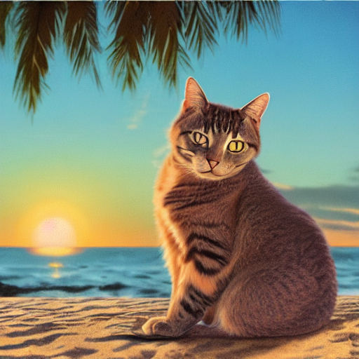

# Stable Diffusion — Text-to-Image Demo

A simple demo of text-to-image generation using Stable Diffusion and the Hugging Face `diffusers` library.

## Example Output

Prompt: `a cat sitting on a beach at sunset, photorealistic`



## Requirements

- Python 3.9+
- [uv](https://astral.sh/uv) package manager
- Apple Silicon (M1/M2/M3) **or** NVIDIA GPU


## Usage

```bash
uv run main.py
```

Output image is saved as `output.png` in the project folder.

## Model

**runwayml/stable-diffusion-v1-5** — downloaded automatically from Hugging Face Hub on first run (~4GB).
Cached locally at `~/.cache/huggingface/hub/`.

## Key Parameters

| Parameter | Default | Description |
|---|---|---|
| `num_inference_steps` | 30 | More steps = better quality, slower. Range: 20–50 |
| `guidance_scale` | 7.5 | CFG scale — how strongly the model follows the prompt. Range: 5–15 |

## Device Configuration

**Apple Silicon (M1/M2/M3):**
```python
pipe = pipe.to("mps")
```
Requires PyTorch 2.0+ and macOS 12.3+.

**NVIDIA GPU:**
```python
pipe = pipe.to("cuda")
```

## Notes

- First run downloads ~4GB model weights — subsequent runs use the local cache
- `torch.float16` (half precision) reduces VRAM usage and speeds up generation
- To try different images just change the `prompt` string in `main.py`
